# Cancer Detection Using Convolutional Neural Networks

## Table of Contents

- <a href="https://github.com/mkpetterson/Cancer_Prediction#Introduction">Introduction</a> 
- <a href="https://github.com/mkpetterson/Cancer_Prediction#data-acquisition-exploration-and-preparation">Data Acquisition and Exploration</a> 
- <a href="https://github.com/mkpetterson/Cancer_Prediction#neural-network-selection">Neural Network Selection</a> 
- <a href="https://github.com/mkpetterson/Cancer_Prediction#model-performance">Model Performance</a> 
- <a href="https://github.com/mkpetterson/Cancer_Prediction#conclusion">Conclusion</a>

## Introduction

Cancer is the second leading cause of death in the United States1, with over 1.7 million people expected to be diagnosed this year2. Among the different types of cancer, lung and breast are the most common. Radiography is one of the first diagnostic tests used to diagnose tumors and subsequent biopsy can determine if a tumor is malignant of benign. Early detection is key to improving outcomes. 

The advent of image classification through machine learning has given the medical industry another tool with which to help diagnose patients. While advanced imaging algorithms and neural networks cannot replace medical professionals, this technology can help guide the diagnosis. 

The goal of this project was to build a simple breast cancer image classifier using convolutional neural networks using both histology (microscopic) images from biopsies and radiographic images (mammograms). Additionally, Radon transforms and Fast Fourier Transforms were applied to see if they could augment the predictions. 2 different CNNs were investigated: Tensorflow and Pytorch-based FastAI. 

## Data Acquisition, Exploration, and Preparation

### Data Acquisition

- The Histology data was pulled from the [Breast Cancer Histopathological Database](https://web.inf.ufpr.br/vri/databases/breast-cancer-histopathological-database-breakhis/) and contains 2 different classes: >2400 benign images and >5400 malignant images at 4 different magnifications (40X, 100X, 200X, 400X).
    - Images were from a total of 82 patients, with several images at each magnification for each patient
    - Images were all 700x460 .png files with 3 channels (RGB)

- Radiographic images were pulled from two different sites: [The Cancer Imaging Archive](https://www.cancerimagingarchive.net/) and the [USF Digital Mammography Database](http://www.eng.usf.edu/cvprg/Mammography/Database.html).
    - Images from The Cancer Imaging Archive were in DICOM format with accompanying metadata
    - Images from USF Database were in .LJPEG format, a lossless jpeg compression format developed by Stanford
    - Malignancies were grossly identified in some images, but not obvious in most. 

### Data Exploration

A sample of the images are shown below. Note that these thumbnails are the images after fixing the the aspect ratio and image size and not the original images. 

<b>Histolopathological Images</b>

<table>
    <th>Tumor Type</th>
    <th>40X</th>
    <th>100X</th>
    <th>200X</th>
    <th>400X</th>
    <tr>
        <td>Benign</td>
        <td>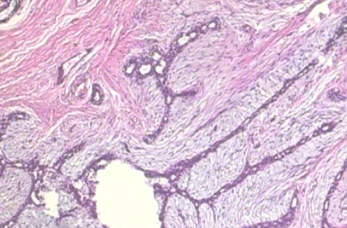</td>
        <td>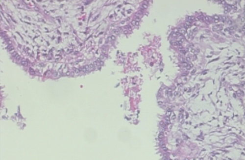</td>
        <td>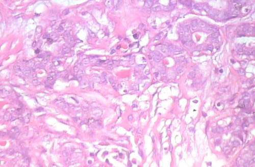</td>
        <td></td>
    </tr>
    <tr>
        <td>Malignant</td>
        <td></td>
        <td></td>
        <td></td>
        <td>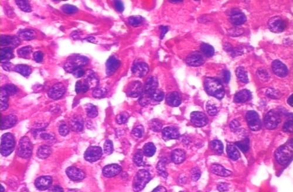</td>
    </tr>
</table>    
          

<b>Radiographic Images</b>
          
<table>
    <th>Pathology</th>
    <th>Craniocaudal (CC)</th>
    <th>Craniocaudal (CC)</th>
    <th>Mediolateral Oblique (MLO)</th>
    <th>Mediolateral Oblique (MLO)</th>
    <tr>
        <td>Normal</td>
        <td></td>
        <td>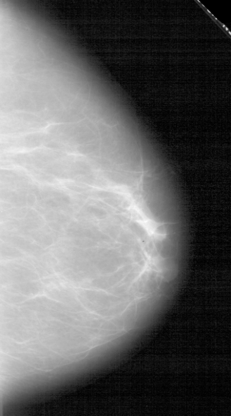</td>
        <td></td>
        <td></td>
    </tr>
    <tr>
        <td>Cancer</td>
        <td>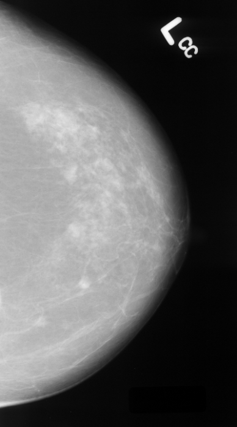</td>
        <td>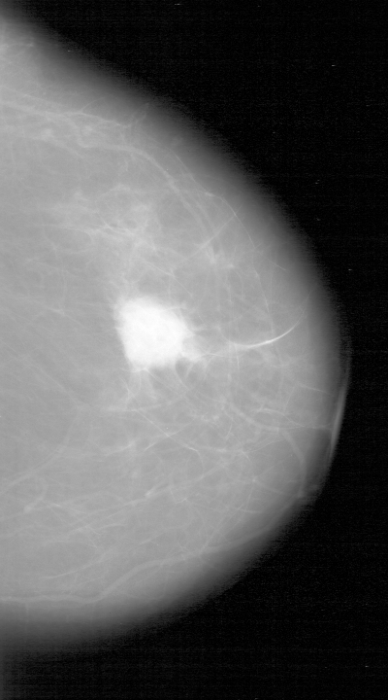</td>
        <td></td>
        <td></td>
    </tr>
</table> 

### Data Preparation

The neural network expects all the images to have the same dimensions, which also includes color channels. The histology images required very little processing as the entire dataset was quite uniform. 

The mammograms required more extensive processing:
- Dicom images were explored using pydicom and the pixel array was extracted into a numpy array
- .LJPEG images were unpacked using a modified python script from [here](https://github.com/aaalgo/ljpeg)
- 10% of the image height and width were cropped to eliminate edge effects 
- The aspect ratio was determined and either rows or columns were minamally cropped to maintain a uniform AR across all images (no squishing)
- The images were resized to 400x720 pixels

Sinograms and Fast Fourier Transforms were applied to the images after processing. Some examples of sinogram and FFT transforms are shown below for the histology and radiographic images. 

<table>
    <th>Radiographic Images</th>
    <th>Histology Images</th>
    <tr>
        <td></td>
        <td></td>
    </tr>
</table>

The data was split into train/validation/test sets with the percentages of each being 70/20/10. Model performance was gauged based on both accuracy and AUC of the test set. The distribution of the classes was around 60/40 for both dataset. 

## Neural Network Selection

In an effort to learn more about neural networks, 3 models based on 2 different ML libraries were selected:
1. A simple Convolutional Neural Network built with Keras using only 10 layers. 
2. A complex CNN based off the TensorFlow Xception model. This has 126 layers and used the imagenet weights. Only the head (last 2 layers) were made trainable.
3. Pytorch-based FastAI, which was the most user-friendly of all the models. Both the resnet34 and the resnet152 were explored. 

Out of box accuracy for the 3 models on the histology data set:

1. Simple CNN: 69% on validation and training. Ended up abandoning this model.
2. TF Xception: 88% on training and 75% on validation. 
3. FastAI: 92% on validation set

The Xception model and FastAI were used for further investigation. Details and performance on the trianing and cross-validation are below in the dropdown menus. Custom classes were created to streamlime fitting and predicting on the models for the various datasets. The FastAI model was eventually selected for optimization on both sets of data due to it's relatively quick run-time and good performance. 

A side exploration into data leakage.... 
The performance on the mammograms was initially 99.9% on FastAI and over 90% on the TensorFlow model, indicating there was potentially a problem with data leakage or that the model was finding a highly distinguising factor between the cancer and non-cancer images that was unlikely to be a tumor. Further investigation led me to believe that the model was not fitting on tumors, but rather on the image quality: the DICOM images wer from TCIA database and had markely better contrast and were less grainy. The non-cancer images were more likely to have noise and be more blurry. This was rectified by downloading lower quality cancer images from the USF database. 

    

    
FastAI Model

    
The FastAI model is a user-friendly model built off of Pytorch. The resnet model was specifically developed for "Deep Residual Learning for Image Recognition". The resnet34 and resnet152 models have (unsurprisingly) 34 and 152 layers, respectively. More information on the architecture of these models can be found [here](https://arxiv.org/abs/1512.03385). No meaingingful difference was found between the performance of the models, with both having an AUC on the test set of 0.72 and 0.71. 
    
The Confusion Matrix for the Histology and Mammogram (CC View) are shown below. The accuracy on the validation set for the histology and mammogram data were 92% and 65%, respectively. 

<table>
    <th>Histology</th>
    <th>Mammograms</th>
    <tr>
        <td> </td>
        <td>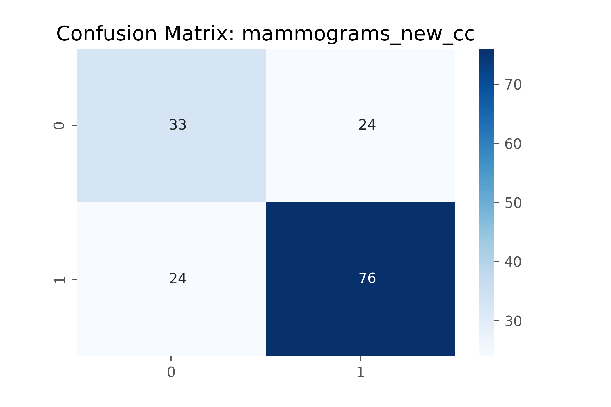 </td>
    </tr>
</table>

    
    
    

    
Xception Model

    
The Xception model, which is explained in detail [here](https://arxiv.org/abs/1610.02357) is a 126 layer model optimized for image performance. Weights from the ImageNet database were loaded and only the last few layers (head) of the model were trained on the histology and mammogram data. Model performance was worse than FastAI, with trends towards overfitting. 
    
<table>
    <th>Train/Validation</th>
    <th>Histology</th>
    <th>Mammogram</th>
    <tr>
        <td>Training Set</td>
        <td>91% Accuracy</td>
        <td>68% Accuracy</td>
    </tr>
    <tr>
        <td>Validation Set</td>
        <td>65%-79% Accuracy</td>
        <td>74% Accuracy</td>
    </tr>
    </table>
    
Even though the accuracy of the Xception Model was 74% on the Validation set, the performane on the test set was poor, as shown in this ROC curve. This highlights why accuracy is not always the best metric with which to judge the performance of any classification algorithm. 

 

    
    
Due to the better performance by FastAI, that was the model chosen for subsequent investigations. 
      
    

     
    
         

## Model Performance

<b>Histology Images</b>

Using FASTAI with thre resnet34 model (34 layers), we achieved an accuracy of >90% on the validation set and >87% on the test set across all the magnifications for the normal images. Looking at the AUC curves shows excellent performance across all magnifications ranging from 0.92 to 0.97. The Fourier Transforms of the data did not perform well and are barely above random guessing. 

<table>
    <th>No Transform</th>
    <th>FFT</th>
    <tr>
        <td>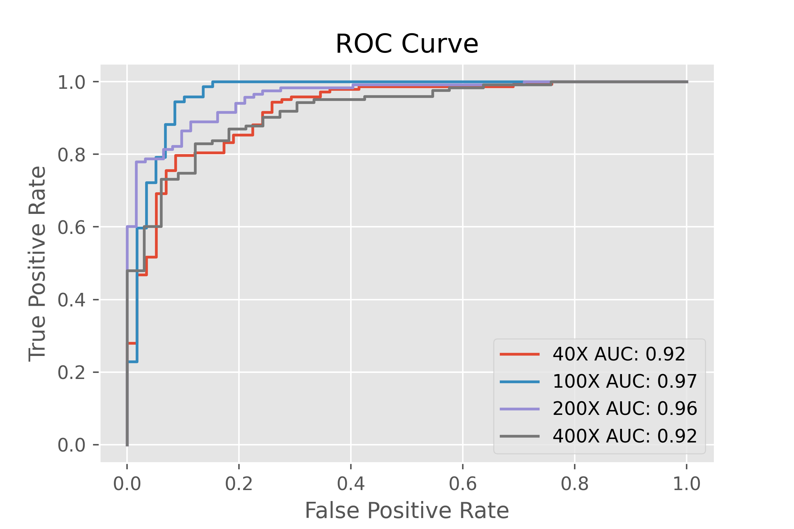</td>
        <td></td>
    </tr>
</table>

<b>Radiographic Images</b>

The performance on the mammograms was less than the histology data. This is unsurprising given that a fair number of the positive cases are indistinguisable from the negative cases upon a cursory look at all the data. The MLO and CC datasets were trained separately and the CC cases outperformed MLO by roughly +10% on accuracy. This is likely due to the MLO images including sections of pectoral muscle, which could have increased the difficulty in training the model.  
<table>
    <th>Image View</th>
    <th>No Transform</th>
    <th>Sinograms</th>
    <tr>
        <td>CC View</td>
        <td>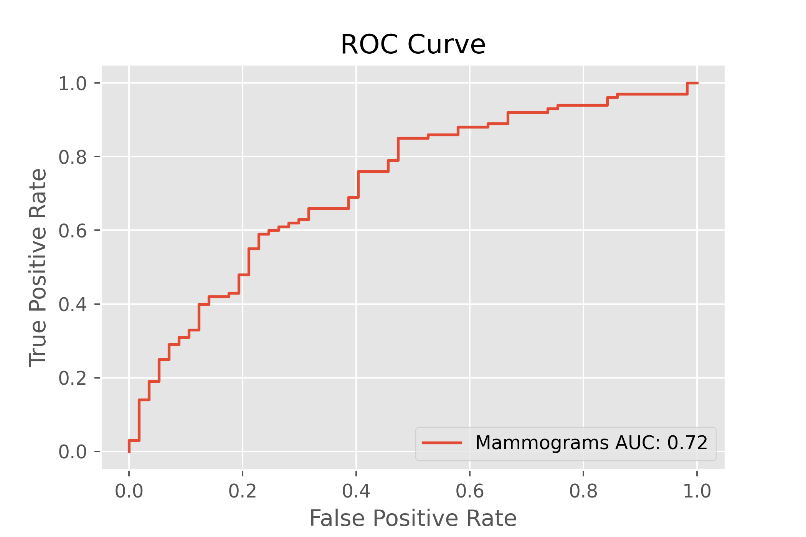</td>
        <td>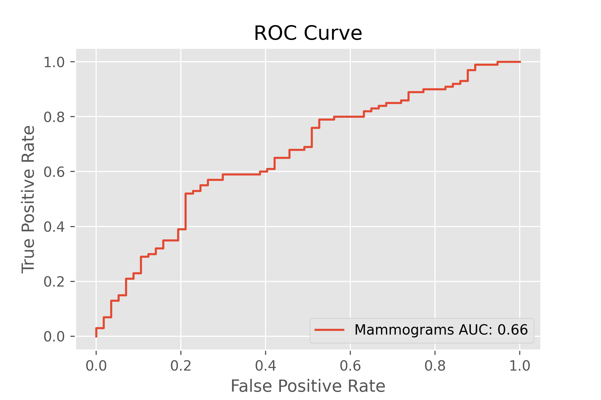</td>
    </tr>
    <tr>
        <td>MLO View</td>
        <td>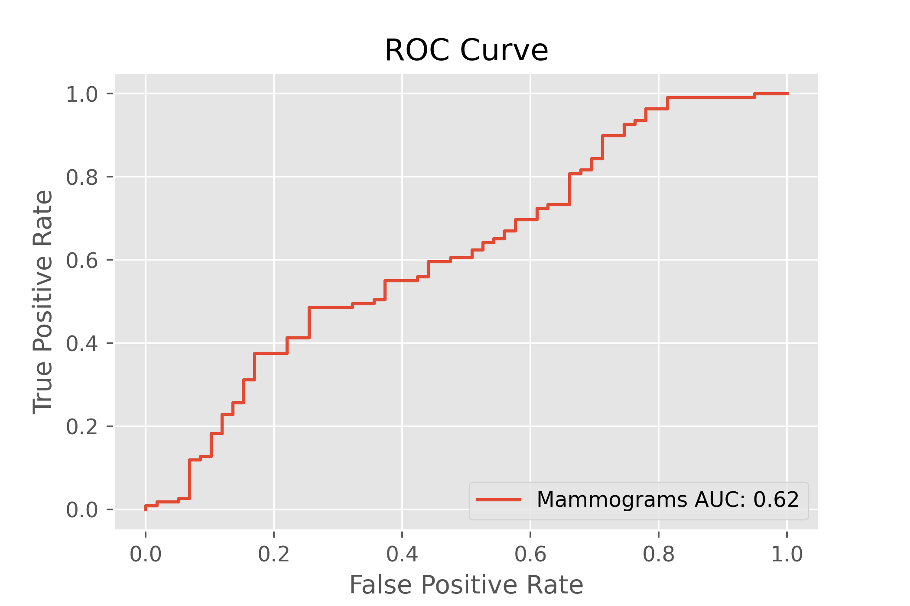</td>

</table>

The transforms did not add value to the cancer prediction. Creating an aggregate model by averaging the predicted probabilities for both the sinogram images and the raw images yields a negligibly better outcome. Shown below is the ROC curve for the CC mammogram view. Displayed are both the ROC for raw images only, and the ROC for the aggregate model of raw images + sinograms. 

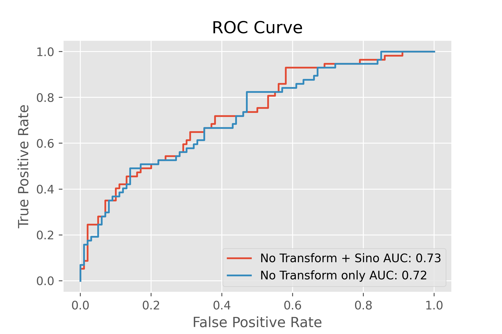

    
## Conclusion

The FastAI model had great performance on the histology slides and good performance on the mammograms. Both models could certainly be used to augment medical professionals in diagnosing cancer. 

Some additional experimentation was done by building an interactive app with Flask to allow a user to gauge their ability at detecting cancer. This should get posted on an EC2 to allow anyone to explore the data. 
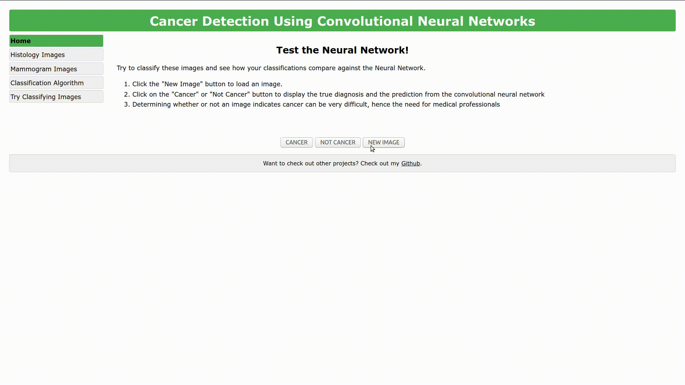

### Notes

1. https://www.cdc.gov/nchs/fastats/leading-causes-of-death.htm
2. https://www.cancer.gov/about-cancer/understanding/statistics
